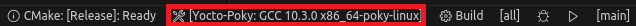

# Vscode Project Template for Yocto Project Cross-Compile Environment
## Introduction
This is a vscode project template for yocto project cross-compile environment. It is based on the [yocto project](https://www.yoctoproject.org/) and [vscode](https://code.visualstudio.com/). It is a simple and easy-to-use template for yocto project cross-compile environment. It can be used to develop and debug applications on the target board. It can also be used to develop and debug applications on the host machine.
## Needed vscode extensions
- C/C++ (ms-vscode.cpptools)
- C/C++ Extension Pack (ms-vscode.cpptools-extension-pack)
- CMake (twxs.cmake)
- CMake Tools (ms-vscode.cmake-tools)

## Setup your `cmake-kits.json` file
The cmake-kits.json file is used to configure the cross-compile environment. You need to modify the following parameters according to your own situation:
```json
[
    {
        "name": "Yocto-Poky: GCC/G++ for x86_64-pokysdk-linux",
        "compilers": {
            "C": "/opt/poky/3.3.4/sysroots/x86_64-pokysdk-linux/usr/bin/x86_64-poky-linux/x86_64-poky-linux-gcc",
            "CXX": "/opt/poky/3.3.4/sysroots/x86_64-pokysdk-linux/usr/bin/x86_64-poky-linux/x86_64-poky-linux-g++"
        },
        "environmentSetupScript": "/opt/poky/3.3.4/environment-setup-corei7-64-poky-linux",
        "toolchainFile": "/opt/poky/3.3.4/sysroots/x86_64-pokysdk-linux/usr/share/cmake/OEToolchainConfig.cmake"
    }
]
```
## Setup you `tasks.json` file for deploying your application to the target board
The tasks.json file is used to configure the deployment of the application to the target board. You need to modify the following parameters according to your own situation:
```json


## Select the active kit
You can select the active kit by clicking the "Select a Kit" button in the lower left corner of the vscode window. The active kit is the cross-compile environment you want to use.
<p align="center"></p>

## Build
You can build your application by clicking the "Build" button in the lower left corner of the vscode window.